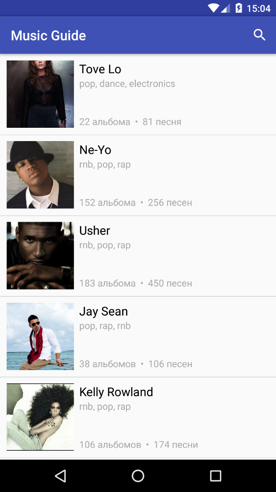

# Music Guide
Music Guide is an Android application that shows information about popular singers.
It was developed as a part of an entrance test to attend Yandex School Of Mobile Development (2016).

### Tech

Music Guide uses a number of open source projects to work properly:

* [Retrofit] - a type-safe HTTP client for Android and Java
* [Picasso] - a powerful image downloading and caching library for Android
* [JUnit 4] - framework to write repeatable tests
* [Espresso] - Android UI testing framework
* [Hamcrest] - a framework for writing matcher objects for testing

### Screenshots

 

[Retrofit]: <http://square.github.io/retrofit/>
[Picasso]: <http://square.github.io/picasso/>
[Espresso]: <https://google.github.io/android-testing-support-library/docs/espresso/index.html>
[Hamcrest]: <http://hamcrest.org/>
[JUnit 4]: <http://junit.org/junit4/>
